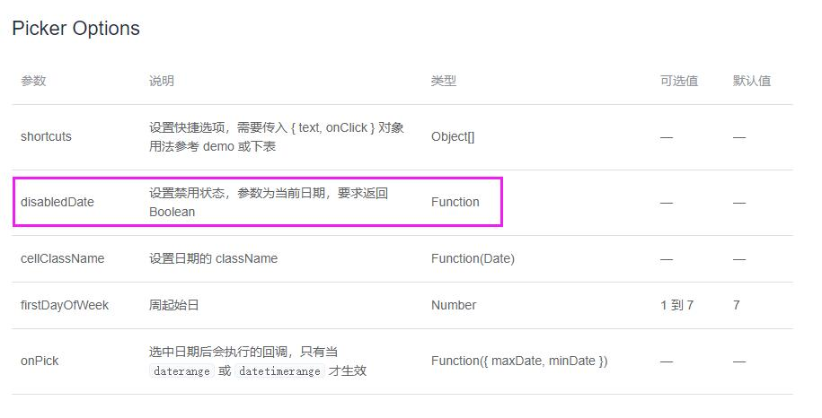

# 组件配置

表单组件、行组件都是通过`render-custom-component`进行动态生成的。   
每一列的配置中有三处地方可以配置component：
 1. column.form.component = 表单组件配置
 2. column.component = 表格行展示组件配置
 3. column.search.component = 查询表单组件配置

通过component.name 配置组件名称  
通过component.props 配置组件参数  
默认监听input和change事件    
使用相关组件前，需要通过`Vue.use` 或 `Vue.component`引入组件
```js
component:{ 
    name: 'dict-select',//组件的名称
    props: { // 组件的配置，具体有哪些参数请查看相关组件的说明文档
       multiple: true,
       elProps: {...}, // 如果该组件封装了element组件，则此属性下面配置封装组件的配置
       //类似的还有 uploader、cropper等
       uploader:{...} //如果该组件封装了uploader，此属性下配置uploader的配置   
    }
} 
```

## 我想要配置组件的某个功能改如何查找文档
下面以`日期选择器禁用今天之前的日期`这个需求为例
### 1. 查看type对应使用的什么组件
日期选择器我们配置的 `type=date`    
所以先去[字段类型列表](/types.html)，查找`type=date`里面用的是什么组件   
在[日期时间选择](/types.html#日期时间选择)这一条中我们找到了`type=date`的配置
```js
date: {
    form: { component: { name: 'el-date-picker' } },
    component: { name: 'date-format', props: { format: 'YYYY-MM-DD' } }
}
```
从这里知道`type=date`使用的`el-date-picker`组件

### 2.查找该组件的文档，确定参数
在[日期时间选择](/types.html#日期时间选择) 拉到下方   
可以看到相关组件的文档链接（如果没有文档链接，请告诉我，我会尽快加上的）
 
  

点击[el-date-picker](https://element.eleme.cn/#/zh-CN/component/date-picker)
跳转到elementUI的文档页面，找到禁用日期相关参数




### 3.给component添加参数
```js
export const crudOptions = (vm) => {
  return {
    columns: [
      {
        title: '日期',
        key: 'date',
        type:'date',
        form:{
          component:{
            props:{
              pickerOptions:{
                disabledDate: time => {
                  return time.getTime() < Date.now()
                }
              }
            }
          }
        }
      }
    ]
  }
}
```